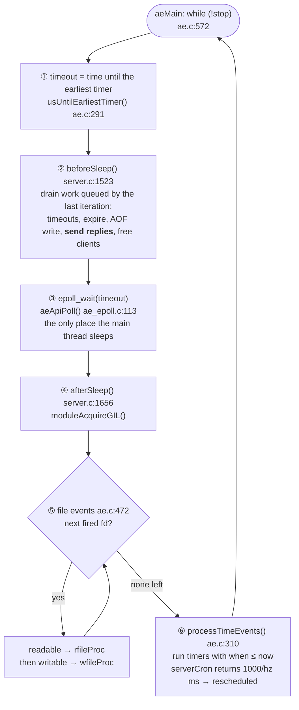
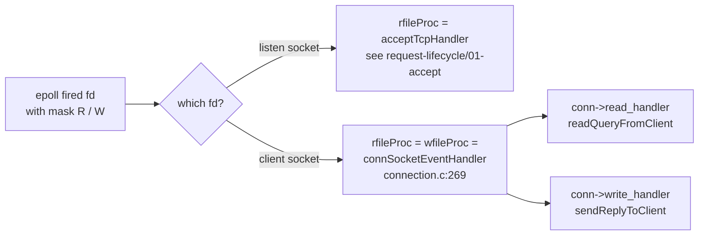

# Event loop (`ae`)

Redis 7.0.5. Paths are relative to `redis7.0-chinese-annotated/src/`.
<!-- code-base: redis7.0-chinese-annotated/src -->

Redis runs one main thread. After startup it never leaves this loop
([`ae.c:572`](https://github.com/CN-annotation-team/redis7.0-chinese-annotated/blob/e352dafc89b0fcdac3071145e7a99c37f3802452/src/ae.c#L572)):

```c
while (!eventLoop->stop)
    aeProcessEvents(eventLoop, AE_ALL_EVENTS | AE_CALL_BEFORE_SLEEP | AE_CALL_AFTER_SLEEP);
```

Each call to `aeProcessEvents()` ([`ae.c:408`](https://github.com/CN-annotation-team/redis7.0-chinese-annotated/blob/e352dafc89b0fcdac3071145e7a99c37f3802452/src/ae.c#L408)) is one **iteration**. Everything
Redis does, whether accepting clients, running commands, writing replies,
expiring keys or persisting, happens inside one of the five steps below.

## One iteration



`beforeSleep` in order ([`server.c:1523`](https://github.com/CN-annotation-team/redis7.0-chinese-annotated/blob/e352dafc89b0fcdac3071145e7a99c37f3802452/src/server.c#L1523)):

| # | Call | What it drains |
|---|---|---|
| 1 | `handleBlockedClientsTimeout()` | `BLPOP` & co. whose timeout expired |
| 2 | `handleClientsWithPendingReadsUsingThreads()`, `tlsProcessPendingData()` | reads finished by io-threads; data TLS already decrypted |
| 3 | `activeExpireCycle(ACTIVE_EXPIRE_CYCLE_FAST)` | a few expired keys, ~1 ms budget ([`expire.c:108`](https://github.com/CN-annotation-team/redis7.0-chinese-annotated/blob/e352dafc89b0fcdac3071145e7a99c37f3802452/src/expire.c#L108)) |
| 4 | `processUnblockedClients()`, `handleClientsBlockedOnKeys()` | clients that were just unblocked run the commands they had pipelined behind the blocking one. The second call is a catch-all for keys made ready outside a command (e.g. a module timer). Normally an `LPUSH` serves waiting `BLPOP` clients right after the command itself ([`server.c:4008`](https://github.com/CN-annotation-team/redis7.0-chinese-annotated/blob/e352dafc89b0fcdac3071145e7a99c37f3802452/src/server.c#L4008)) |
| 5 | `flushAppendOnlyFile(0)` | AOF buffer → `write()` ([`server.c:1629`](https://github.com/CN-annotation-team/redis7.0-chinese-annotated/blob/e352dafc89b0fcdac3071145e7a99c37f3802452/src/server.c#L1629)) |
| 6 | `handleClientsWithPendingWritesUsingThreads()` | **send replies** ([`server.c:1632`](https://github.com/CN-annotation-team/redis7.0-chinese-annotated/blob/e352dafc89b0fcdac3071145e7a99c37f3802452/src/server.c#L1632)) |
| 7 | `freeClientsInAsyncFreeQueue()` | clients marked to close |
| 8 | `evictClients()`, `moduleReleaseGIL()` | clients over `maxmemory-clients`; let module threads run while we sleep |

| Step | What decides it | Typical cost |
|---|---|---|
| ① timeout | earliest time event, normally `serverCron` | O(number of timers), usually 1 |
| ② `beforeSleep` | work queued during the previous iteration | bounded per step |
| ③ `epoll_wait` | the kernel: returns when an fd is ready **or** the timeout passes | 0 CPU while sleeping |
| ④ `afterSleep` | modules only | ~0 |
| ⑤ file events | fds returned by `epoll_wait` | most of the real work: reading and running commands |
| ⑥ time events | timers that are due | `serverCron` every 100 ms by default |

## Why the steps are in this order

**`beforeSleep` exists because handlers queue work instead of doing it.**
While handling file events, Redis keeps finding work it does not want to do
immediately: replies to send, clients to free, clients unblocked by a `LPUSH`.
That work goes into lists (`server.clients_pending_write`,
`server.clients_to_close`, `server.unblocked_clients`) and is drained in
`beforeSleep`, before the thread goes to sleep. Without this hook, the thread
could block in `epoll_wait` with replies still unsent.

**The sleep is bounded by the next timer.** Timers need no extra thread. Step
① computes how long until the earliest timer is due, and passes that as the
`epoll_wait` timeout. With `hz 10` (`CONFIG_DEFAULT_HZ`) and no traffic, the
thread wakes up about every 100 ms to run `serverCron`. With traffic it wakes up
as soon as a socket is ready.

```
t (ms)   0          30                       100
         |──sleep───|                         |
         serverCron client data ready:        serverCron due:
                    epoll_wait returns early  epoll_wait times out
```

**Time events run last, and only if due.** A busy iteration may already be
past a timer's `when`. It runs at the end of that iteration, so timers can be
late but never early. `serverCron` reschedules itself by returning
`1000/server.hz` ([`server.c:1424`](https://github.com/CN-annotation-team/redis7.0-chinese-annotated/blob/e352dafc89b0fcdac3071145e7a99c37f3802452/src/server.c#L1424)). Returning `AE_NOMORE` would delete the timer.

**AOF is written before replies go out.** In `beforeSleep`,
`flushAppendOnlyFile()` ([`server.c:1629`](https://github.com/CN-annotation-team/redis7.0-chinese-annotated/blob/e352dafc89b0fcdac3071145e7a99c37f3802452/src/server.c#L1629)) comes before
`handleClientsWithPendingWritesUsingThreads()` ([`server.c:1632`](https://github.com/CN-annotation-team/redis7.0-chinese-annotated/blob/e352dafc89b0fcdac3071145e7a99c37f3802452/src/server.c#L1632)). A client
therefore never sees `+OK` for a write that has not reached the AOF file yet.

## File events in detail



- Normally readable runs before writable. A reply produced by the read can
  then go out in the same iteration.
- **`AE_BARRIER` reverses that order** for one fd ([`ae.c:497`](https://github.com/CN-annotation-team/redis7.0-chinese-annotated/blob/e352dafc89b0fcdac3071145e7a99c37f3802452/src/ae.c#L497)). Redis sets it when
  `appendfsync always` is on ([`networking.c:240`](https://github.com/CN-annotation-team/redis7.0-chinese-annotated/blob/e352dafc89b0fcdac3071145e7a99c37f3802452/src/networking.c#L240)). Writing first means a
  reply is never sent in the same iteration as the read that produced it,
  so `beforeSleep` gets to fsync the AOF in between.
- For client sockets, `rfileProc` and `wfileProc` are the **same** function,
  `connSocketEventHandler`. `ae.c` checks `wfileProc != rfileProc`
  ([`ae.c:517`](https://github.com/CN-annotation-team/redis7.0-chinese-annotated/blob/e352dafc89b0fcdac3071145e7a99c37f3802452/src/ae.c#L517)) so it doesn't call it twice. The connection layer then picks read
  and/or write and applies the barrier itself (`CONN_FLAG_WRITE_BARRIER`).

## Time events

- They are kept in an **unsorted linked list**. Both finding the earliest
  ([`ae.c:291`](https://github.com/CN-annotation-team/redis7.0-chinese-annotated/blob/e352dafc89b0fcdac3071145e7a99c37f3802452/src/ae.c#L291)) and running due timers ([`ae.c:310`](https://github.com/CN-annotation-team/redis7.0-chinese-annotated/blob/e352dafc89b0fcdac3071145e7a99c37f3802452/src/ae.c#L310)) scan it all. That is fine
  because there are at most three: `serverCron`; one shared timer for all
  module timers ([`module.c:8288`](https://github.com/CN-annotation-team/redis7.0-chinese-annotated/blob/e352dafc89b0fcdac3071145e7a99c37f3802452/src/module.c#L8288)); and a temporary one while eviction
  can't keep up with `maxmemory` ([`evict.c:556`](https://github.com/CN-annotation-team/redis7.0-chinese-annotated/blob/e352dafc89b0fcdac3071145e7a99c37f3802452/src/evict.c#L556)).
- Times use a monotonic clock (`getMonotonicUs()`), so changing the
  system clock doesn't fire or delay timers.
- Deleting a timer only marks it (`AE_DELETED_EVENT_ID`). It is unlinked
  on the next pass, once nothing references it (`refcount`).

## Re-entering the loop

Some long operations, like loading an RDB at startup or running a slow Lua
script, call `processEventsWhileBlocked()`. That runs a few iterations from
**inside** the current one. `beforeSleep` detects this
(`ProcessingEventsWhileBlocked`, [`server.c:1535`](https://github.com/CN-annotation-team/redis7.0-chinese-annotated/blob/e352dafc89b0fcdac3071145e7a99c37f3802452/src/server.c#L1535)) and only does the essentials:
reads, AOF flush, writes, freeing clients. That is how clients get `-LOADING`
or `-BUSY` instead of no answer.
