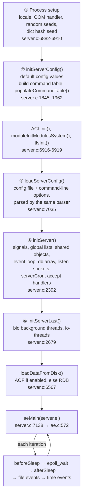

# 00 · Server startup

Redis 7.0.5. Paths are relative to `redis7.0-chinese-annotated/src/`.
<!-- code-base: redis7.0-chinese-annotated/src -->
Everything happens in `main()`, [`server.c:6836`](https://github.com/CN-annotation-team/redis7.0-chinese-annotated/blob/e352dafc89b0fcdac3071145e7a99c37f3802452/src/server.c#L6836).

## ① Process setup

`dictSetHashFunctionSeed()` ([`server.c:6910`](https://github.com/CN-annotation-team/redis7.0-chinese-annotated/blob/e352dafc89b0fcdac3071145e7a99c37f3802452/src/server.c#L6910)) seeds the dict hash function with
random bytes, so every process hashes keys differently. This prevents
hash-flooding attacks that rely on knowing which keys collide.

## ② `initServerConfig()`

Fills every field of the global `server` struct with defaults. It also builds
the **command table**: `server.commands` is a dict ([`server.c:1959`](https://github.com/CN-annotation-team/redis7.0-chinese-annotated/blob/e352dafc89b0fcdac3071145e7a99c37f3802452/src/server.c#L1959)), filled by
`populateCommandTable()` ([`server.c:1962`](https://github.com/CN-annotation-team/redis7.0-chinese-annotated/blob/e352dafc89b0fcdac3071145e7a99c37f3802452/src/server.c#L1962)) from the static table in `commands.c`.
Every request is looked up in this table to find its handler, such as
`set` → `setCommand`.

### `ACLInit()`: why it runs right after the defaults

[`acl.c:1351`](https://github.com/CN-annotation-team/redis7.0-chinese-annotated/blob/e352dafc89b0fcdac3071145e7a99c37f3802452/src/acl.c#L1351). It sets up the ACL subsystem, which was added in 6.0:

| Created | Purpose |
|---|---|
| `Users` (rax) | All users, by name |
| `UsersToLoad` (list) | `user ...` lines found in `redis.conf`. They are only queued here and applied later by `ACLLoadUsersAtStartup()` ([`server.c:7094`](https://github.com/CN-annotation-team/redis7.0-chinese-annotated/blob/e352dafc89b0fcdac3071145e7a99c37f3802452/src/server.c#L7094)) |
| `ACLLog` (list) | Denied attempts, shown by `ACL LOG` |
| `DefaultUser` | The `default` user: `on nopass +@all ~* &*`, i.e. every command, key and channel, no password. That is exactly pre-6.0 behavior, so old setups keep working |

It has to run before config parsing and before any client exists
([`server.c:6916`](https://github.com/CN-annotation-team/redis7.0-chinese-annotated/blob/e352dafc89b0fcdac3071145e7a99c37f3802452/src/server.c#L6916)):

- **Parsing the config needs it.** `requirepass` is now just the password of
  `DefaultUser` ([`config.c:2534`](https://github.com/CN-annotation-team/redis7.0-chinese-annotated/blob/e352dafc89b0fcdac3071145e7a99c37f3802452/src/config.c#L2534)).
- **Creating a client needs it.** `createClient()` → `clientSetDefaultAuth()`
  ([`networking.c:107`](https://github.com/CN-annotation-team/redis7.0-chinese-annotated/blob/e352dafc89b0fcdac3071145e7a99c37f3802452/src/networking.c#L107)) sets `c->user = DefaultUser`. A client counts as
  authenticated from the start only if that user is `nopass`.

The same `DefaultUser` flags then show up on the request path:

- Protected mode rejects non-loopback clients only when `DefaultUser` has
  `nopass` ([`networking.c:1284`](https://github.com/CN-annotation-team/redis7.0-chinese-annotated/blob/e352dafc89b0fcdac3071145e7a99c37f3802452/src/networking.c#L1284)).
- `processCommand()` returns `-NOAUTH` if `authRequired(c)` ([`server.c:3738`](https://github.com/CN-annotation-team/redis7.0-chinese-annotated/blob/e352dafc89b0fcdac3071145e7a99c37f3802452/src/server.c#L3738)),
  then checks command/key/channel permissions with `ACLCheckAllPerm()`
  ([`server.c:3755`](https://github.com/CN-annotation-team/redis7.0-chinese-annotated/blob/e352dafc89b0fcdac3071145e7a99c37f3802452/src/server.c#L3755)).

## ③ Configuration

The config file and options like `--port 6380` are concatenated into one string
and parsed by the same parser ([`server.c:6979-7035`](https://github.com/CN-annotation-team/redis7.0-chinese-annotated/blob/e352dafc89b0fcdac3071145e7a99c37f3802452/src/server.c#L6979-L7035)). That is why command-line
options use exactly the config-file syntax, and why later options override
earlier ones.

## ④ `initServer()`

| Step | Where | Why |
|---|---|---|
| Ignore `SIGHUP`, `SIGPIPE` | [`server.c:2396`](https://github.com/CN-annotation-team/redis7.0-chinese-annotated/blob/e352dafc89b0fcdac3071145e7a99c37f3802452/src/server.c#L2396) | Writing to a socket the peer has closed would otherwise kill the process |
| Global lists: `clients`, `clients_to_close`, `clients_pending_write`, … | [`server.c:2419`](https://github.com/CN-annotation-team/redis7.0-chinese-annotated/blob/e352dafc89b0fcdac3071145e7a99c37f3802452/src/server.c#L2419) | Used throughout the request lifecycle |
| `createSharedObjects()` | [`server.c:1679`](https://github.com/CN-annotation-team/redis7.0-chinese-annotated/blob/e352dafc89b0fcdac3071145e7a99c37f3802452/src/server.c#L1679) | Preallocated replies (`+OK`, errors) and integers 0–9999 (`OBJ_SHARED_INTEGERS`) |
| `adjustOpenFilesLimit()` + `aeCreateEventLoop(maxclients + 128)` | [`server.c:2479-2483`](https://github.com/CN-annotation-team/redis7.0-chinese-annotated/blob/e352dafc89b0fcdac3071145e7a99c37f3802452/src/server.c#L2479-L2483) | The event loop indexes an array by fd, so it is sized up front |
| `server.db[]`, each with `dict` + `expires` | [`server.c:2531`](https://github.com/CN-annotation-team/redis7.0-chinese-annotated/blob/e352dafc89b0fcdac3071145e7a99c37f3802452/src/server.c#L2531) | The keyspace |
| `listenToPort()` | [`server.c:2496`](https://github.com/CN-annotation-team/redis7.0-chinese-annotated/blob/e352dafc89b0fcdac3071145e7a99c37f3802452/src/server.c#L2496) | `bind` + `listen`. The kernel can now accept handshakes |
| `aeCreateTimeEvent(serverCron)` | [`server.c:2609`](https://github.com/CN-annotation-team/redis7.0-chinese-annotated/blob/e352dafc89b0fcdac3071145e7a99c37f3802452/src/server.c#L2609) | Periodic housekeeping |
| `createSocketAcceptHandler(acceptTcpHandler)` | [`server.c:2617`](https://github.com/CN-annotation-team/redis7.0-chinese-annotated/blob/e352dafc89b0fcdac3071145e7a99c37f3802452/src/server.c#L2617) | Listen fd readable → accept, see [01-accept](01-accept.md) |
| `aeSetBeforeSleepProc(beforeSleep)` | [`server.c:2641`](https://github.com/CN-annotation-team/redis7.0-chinese-annotated/blob/e352dafc89b0fcdac3071145e7a99c37f3802452/src/server.c#L2641) | Hook run before each `epoll_wait` |

## ⑤ Last steps

`InitServerLast()` starts the `bio` background threads (closing files, fsync,
lazy free) and, if configured, the I/O threads.

**The server listens before it loads data.** During `loadDataFromDisk()`, the
loader calls `processEventsWhileBlocked()` regularly ([`rdb.c:2852`](https://github.com/CN-annotation-team/redis7.0-chinese-annotated/blob/e352dafc89b0fcdac3071145e7a99c37f3802452/src/rdb.c#L2852), [`aof.c:1632`](https://github.com/CN-annotation-team/redis7.0-chinese-annotated/blob/e352dafc89b0fcdac3071145e7a99c37f3802452/src/aof.c#L1632)).
Clients that connect during loading therefore get a `-LOADING` error instead of
a connection that hangs.
