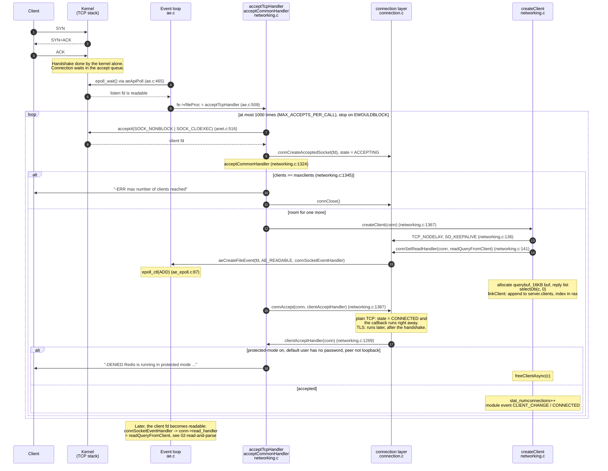

# 01 · Accepting a connection

Redis 7.0.5. Paths are relative to `redis7.0-chinese-annotated/src/`.
<!-- code-base: redis7.0-chinese-annotated/src -->

What happens between the client's `connect()` and the moment Redis is ready
to read that client's first command.

## Before any client arrives

Set up during startup (see [00-startup](00-startup.md)):

- `listen(fd, backlog)`: [`anet.c:417`](https://github.com/CN-annotation-team/redis7.0-chinese-annotated/blob/e352dafc89b0fcdac3071145e7a99c37f3802452/src/anet.c#L417). The kernel can now finish TCP handshakes on its own.
- `aeCreateFileEvent(listen_fd, AE_READABLE, acceptTcpHandler)`: [`server.c:2252`](https://github.com/CN-annotation-team/redis7.0-chinese-annotated/blob/e352dafc89b0fcdac3071145e7a99c37f3802452/src/server.c#L2252)
  (`createSocketAcceptHandler`). The listening socket is registered with the
  event loop **directly**, without the `connection` abstraction.

## Sequence

## Key points

**The callback chain is two levels deep for client sockets.** epoll knows only
`connSocketEventHandler` ([`connection.c:269`](https://github.com/CN-annotation-team/redis7.0-chinese-annotated/blob/e352dafc89b0fcdac3071145e7a99c37f3802452/src/connection.c#L269)). That function reads `conn->read_handler`
/ `conn->write_handler` and calls the right one. The extra level lets the same
networking code run over plain TCP, TLS and Unix sockets, which have different
`ConnectionType`s. It also lets the connection layer reorder read/write when
`CONN_FLAG_WRITE_BARRIER` is set (write before read, used so that AOF fsync can
happen before the reply goes out).

**Non-blocking from the start.** `accept4` sets `O_NONBLOCK` atomically
([`anet.c:516`](https://github.com/CN-annotation-team/redis7.0-chinese-annotated/blob/e352dafc89b0fcdac3071145e7a99c37f3802452/src/anet.c#L516)). With a single main thread, a blocking `read` on any client would
stall every client.

**Bounded work per wakeup.** At most 1000 accepts per callback. The rest stays
in the kernel queue for the next loop iteration, so a connection storm can't
starve clients that are already connected.

**Reject politely.** When over `maxclients`, Redis still accepts the socket so it
can write an error before closing. Otherwise the client would just hang in the
backlog. Protected mode does the same with `-DENIED`.

**The `client` struct exists before the connection is fully "accepted".**
`createClient` runs before `connAccept`. A client rejected by protected mode is
therefore already in `server.clients`, and has to be torn down via
`freeClientAsync` (see the resource-cleanup stage).

## What `createClient` allocates

| Field | Initial value | Purpose |
|---|---|---|
| `c->conn` | the accepted connection | socket and its handlers |
| `c->querybuf` | empty `sds` | input buffer (stage 02) |
| `c->buf` | 16KB (`PROTO_REPLY_CHUNK_BYTES`) | fixed output buffer, used first |
| `c->reply` | empty list | overflow output buffer, used once `buf` is full |
| `c->db` | db 0 | current database |
| `c->client_list_node` | node in `server.clients` | O(1) removal on free |

Everything here must be released again when the client goes away, which is
the last stage of the lifecycle.
