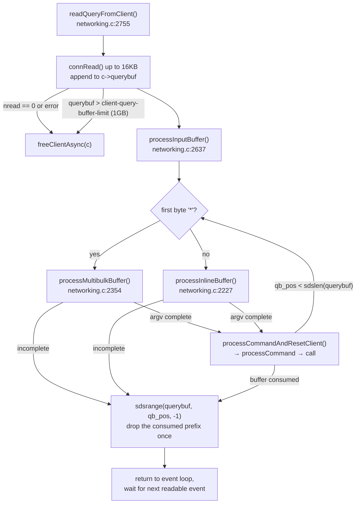

# 02 · Reading and parsing a request

Redis 7.0.5. Paths are relative to `redis7.0-chinese-annotated/src/`.
<!-- code-base: redis7.0-chinese-annotated/src -->

TCP is a byte stream: one `read()` does not line up with one command. A read
can end mid-command, or contain several commands (pipelining). Both cases are
handled by keeping **all** bytes in `c->querybuf`, parsing every complete command
in a loop, and leaving the incomplete tail for the next read.

## Example

A client pipelines `SET foo bar` and `GET foo`. The bytes arrive in two reads:

```
read #1:  *3\r\n$3\r\nSET\r\n$3\r\nfoo\r\n$3\r\nb
                                              ↑ incomplete: only "b" of "bar"
read #2:  ar\r\n*2\r\n$3\r\nGET\r\n$3\r\nfoo\r\n
          ↑ rest of SET  ↑ a complete GET
```

After read #1 the parse state is saved in the client: `argv = [SET, foo]`,
`multibulklen = 1` (one argument left), `bulklen = 3`. Read #2 resumes from
there. Nothing is parsed twice.

## Flow



## Key points

**`qb_pos` is a cursor.** Each parsed command only advances it. The consumed
prefix is cut off once, after the loop, so a pipeline of 100 commands costs one
memmove, not 100.

**Big arguments (≥ 32KB, `PROTO_MBULK_BIG_ARG`).** `readQueryFromClient` reads
exactly the remaining bytes of the argument. If the argument then fills
`querybuf` exactly, `querybuf` itself becomes the argv string object, with no
copy ([`networking.c:2484-2493`](https://github.com/CN-annotation-team/redis7.0-chinese-annotated/blob/e352dafc89b0fcdac3071145e7a99c37f3802452/src/networking.c#L2484-L2493)), and a fresh `querybuf` is allocated.

**Limits.** A client that never completes a command would grow `querybuf`
without bound, so it is capped by `client-query-buffer-limit` (default 1GB).
A single inline line or bulk-length line is capped at 64KB
(`PROTO_INLINE_MAX_SIZE`).

**When the loop stops early.** It also breaks out if the client is blocked
(e.g. `BLPOP`), already has a pending command (io-threads), or is flagged to
close.
