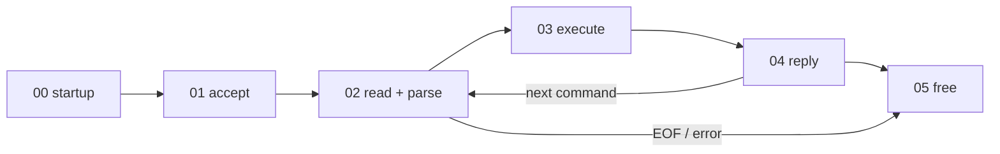

# Request lifecycle

How Redis starts, then follows one request from the client's `connect()` to
the reply being sent and the client's resources being freed.

Based on Redis **7.0.5** (`redis7.0-chinese-annotated/`), whose Chinese
comments are useful to read alongside. 5.0 follows the same path, minus ACL,
io-threads and the `connection` abstraction layer.

| # | Stage | Status |
|---|---|---|
| 00 | [Server startup](00-startup.md) | done |
| 01 | [Accepting a connection](01-accept.md) | done |
| 02 | [Reading and parsing a request](02-read-and-parse.md) | done |
| 03 | Executing the command: `processCommand` → `call` → `setCommand` | todo |
| 04 | Writing the reply: `addReply`, `clients_pending_write`, `beforeSleep` | todo |
| 05 | Releasing resources: `resetClient`, `freeClient`, `freeClientAsync`, `clientsCron` | todo |

