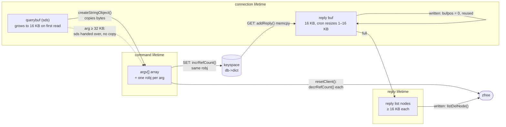

# Memory of a request: what is allocated, who owns it, when it is freed

Redis 7.0.5. Paths are relative to `redis7.0-chinese-annotated/src/`.
<!-- code-base: redis7.0-chinese-annotated/src -->

This note follows the memory behind one request through stages 01–05. All
allocations go through `zmalloc` / `zfree`, which add every size to a single
atomic counter ([`zmalloc.c:95`](https://github.com/CN-annotation-team/redis7.0-chinese-annotated/blob/e352dafc89b0fcdac3071145e7a99c37f3802452/src/zmalloc.c#L95)). That counter is the `used_memory` that
`maxmemory` is compared against, so client buffers count toward `maxmemory`
just like keys do.

## Three lifetimes

Each piece of memory a request touches lives for one of three lifetimes:

| Lifetime | What | Allocated | Freed |
|---|---|---|---|
| **Connection** | `client` struct, `querybuf`, reply `buf`, the empty `reply` list, dicts/lists for blocking, WATCH and pub/sub | `createClient()` | `freeClient()` |
| **Command** | the `argv[]` array and one `robj` per argument | parser, `processMultibulkBuffer()` | `resetClient()` after the command |
| **Reply** | `clientReplyBlock` nodes once `buf` is full | `_addReplyProtoToList()` | as soon as their bytes are written |

A fourth kind of memory **outlives the request**: a value that a write command
stores in the keyspace. For `SET`, that value is the same `robj` the parser
created. It is never copied (see [SET: the argument becomes the value](#set-the-argument-becomes-the-value)).



## 1. Connection memory: `createClient()`

`createClient()` ([`networking.c:124`](https://github.com/CN-annotation-team/redis7.0-chinese-annotated/blob/e352dafc89b0fcdac3071145e7a99c37f3802452/src/networking.c#L124)) makes these allocations:

| Allocation | Where | Size |
|---|---|---|
| `client` struct | [`networking.c:126`](https://github.com/CN-annotation-team/redis7.0-chinese-annotated/blob/e352dafc89b0fcdac3071145e7a99c37f3802452/src/networking.c#L126) | `sizeof(client)`, a few hundred bytes |
| reply `buf` | [`networking.c:145`](https://github.com/CN-annotation-team/redis7.0-chinese-annotated/blob/e352dafc89b0fcdac3071145e7a99c37f3802452/src/networking.c#L145) | `PROTO_REPLY_CHUNK_BYTES` = 16 KB ([`server.h:165`](https://github.com/CN-annotation-team/redis7.0-chinese-annotated/blob/e352dafc89b0fcdac3071145e7a99c37f3802452/src/server.h#L165)) |
| `querybuf` | [`networking.c:160`](https://github.com/CN-annotation-team/redis7.0-chinese-annotated/blob/e352dafc89b0fcdac3071145e7a99c37f3802452/src/networking.c#L160) | `sdsempty()`, header only. It grows on the first read |
| `reply` list | [`networking.c:189`](https://github.com/CN-annotation-team/redis7.0-chinese-annotated/blob/e352dafc89b0fcdac3071145e7a99c37f3802452/src/networking.c#L189) | empty list header |
| `bpop.keys`, `watched_keys`, `pubsub_*` | [`networking.c:197-208`](https://github.com/CN-annotation-team/redis7.0-chinese-annotated/blob/e352dafc89b0fcdac3071145e7a99c37f3802452/src/networking.c#L197-L208) | empty dicts and lists |

This memory belongs to the connection. It is reused for every command and only
released in `freeClient()`. Its size is not fixed, though: `clientsCron()`
resizes both buffers in the background (section 6).

## 2. Read: the query buffer grows in place

`readQueryFromClient()` ([`networking.c:2755`](https://github.com/CN-annotation-team/redis7.0-chinese-annotated/blob/e352dafc89b0fcdac3071145e7a99c37f3802452/src/networking.c#L2755)) reserves room before each
`read()`:

- **Normally** it asks for `PROTO_IOBUF_LEN` = 16 KB ([`networking.c:2773`](https://github.com/CN-annotation-team/redis7.0-chinese-annotated/blob/e352dafc89b0fcdac3071145e7a99c37f3802452/src/networking.c#L2773)).
  While the buffer is under 16 KB it grows exactly that much
  (`sdsMakeRoomForNonGreedy`, [`networking.c:2807`](https://github.com/CN-annotation-team/redis7.0-chinese-annotated/blob/e352dafc89b0fcdac3071145e7a99c37f3802452/src/networking.c#L2807)). Beyond that it grows
  greedily and reads as much as fits ([`networking.c:2810-2813`](https://github.com/CN-annotation-team/redis7.0-chinese-annotated/blob/e352dafc89b0fcdac3071145e7a99c37f3802452/src/networking.c#L2810-L2813)), to save
  `read()` calls.
- **A big argument** (`$` length ≥ `PROTO_MBULK_BIG_ARG` = 32 KB) is handled
  differently. The parser first moves the unparsed bytes to the start of the
  buffer and reserves exactly `bulklen + 2` bytes ([`networking.c:2459-2463`](https://github.com/CN-annotation-team/redis7.0-chinese-annotated/blob/e352dafc89b0fcdac3071145e7a99c37f3802452/src/networking.c#L2459-L2463)).
  Reads then fetch only what is still missing, so the buffer ends up holding
  exactly that one argument.

After a batch of commands has been parsed, the consumed prefix is removed with
`sdsrange()` ([`networking.c:2741`](https://github.com/CN-annotation-team/redis7.0-chinese-annotated/blob/e352dafc89b0fcdac3071145e7a99c37f3802452/src/networking.c#L2741)). That is a `memmove` inside the same
allocation, not a free. The allocation is only shrunk later, by the cron.

## 3. Parse: per-command `argv`

`processMultibulkBuffer()` makes these allocations for every command:

| Allocation | Where | Notes |
|---|---|---|
| `argv[]` pointer array | [`networking.c:2398-2400`](https://github.com/CN-annotation-team/redis7.0-chinese-annotated/blob/e352dafc89b0fcdac3071145e7a99c37f3802452/src/networking.c#L2398-L2400) | `min(argc, 1024)` slots. Doubled with `zrealloc` if a command has more ([`networking.c:2475-2477`](https://github.com/CN-annotation-team/redis7.0-chinese-annotated/blob/e352dafc89b0fcdac3071145e7a99c37f3802452/src/networking.c#L2475-L2477)) |
| one `robj` per argument | [`networking.c:2496-2497`](https://github.com/CN-annotation-team/redis7.0-chinese-annotated/blob/e352dafc89b0fcdac3071145e7a99c37f3802452/src/networking.c#L2496-L2497) | `createStringObject()` **copies** the bytes out of `querybuf` |
| big argument (≥ 32 KB) | [`networking.c:2483-2494`](https://github.com/CN-annotation-team/redis7.0-chinese-annotated/blob/e352dafc89b0fcdac3071145e7a99c37f3802452/src/networking.c#L2483-L2494) | **no copy**: the whole `querybuf` sds becomes the argument's `robj`, and the client gets a fresh `querybuf` of `bulklen + 2` bytes |

`createStringObject()` ([`object.c:157`](https://github.com/CN-annotation-team/redis7.0-chinese-annotated/blob/e352dafc89b0fcdac3071145e7a99c37f3802452/src/object.c#L157)) picks one of two layouts:

- **≤ 44 bytes → `EMBSTR`**: one `zmalloc` holds the `robj` header, the sds
  header and the bytes together ([`object.c:113`](https://github.com/CN-annotation-team/redis7.0-chinese-annotated/blob/e352dafc89b0fcdac3071145e7a99c37f3802452/src/object.c#L113)). 16 + 3 + 44 + 1 = 64 bytes,
  exactly one jemalloc size class. `OBJ_ENCODING_EMBSTR_SIZE_LIMIT` is 44
  ([`object.c:156`](https://github.com/CN-annotation-team/redis7.0-chinese-annotated/blob/e352dafc89b0fcdac3071145e7a99c37f3802452/src/object.c#L156)).
- **Longer → `RAW`**: two allocations, one for the `robj` and one for the sds.

So a pipelined `SET k v` costs about three small allocations on the parse side:
the array, `"SET"` and `"k"`. The fourth one, `"v"`, survives in the
keyspace.

## 4. Execute: reference counts decide who frees

Every `robj` has a `refcount`. `decrRefCount()` ([`object.c:409`](https://github.com/CN-annotation-team/redis7.0-chinese-annotated/blob/e352dafc89b0fcdac3071145e7a99c37f3802452/src/object.c#L409)) frees the
object when the count drops from 1. `incrRefCount()` ([`object.c:397`](https://github.com/CN-annotation-team/redis7.0-chinese-annotated/blob/e352dafc89b0fcdac3071145e7a99c37f3802452/src/object.c#L397)) leaves
**shared objects** alone: those have
`refcount == OBJ_SHARED_REFCOUNT` (`INT_MAX`, [`server.h:847`](https://github.com/CN-annotation-team/redis7.0-chinese-annotated/blob/e352dafc89b0fcdac3071145e7a99c37f3802452/src/server.h#L847)) and are never
freed. Shared objects include `shared.ok`, the common errors and the integers
0–9999, all created once at startup (see [00-startup](00-startup.md)).

### SET: the argument becomes the value

1. `setCommand()` re-encodes the value ([`t_string.c:377`](https://github.com/CN-annotation-team/redis7.0-chinese-annotated/blob/e352dafc89b0fcdac3071145e7a99c37f3802452/src/t_string.c#L377)).
   `tryObjectEncoding()` ([`object.c:642`](https://github.com/CN-annotation-team/redis7.0-chinese-annotated/blob/e352dafc89b0fcdac3071145e7a99c37f3802452/src/object.c#L642)) may **swap** `argv[2]` for something
   smaller:
   - `"123"` → the shared integer object ([`object.c:675-679`](https://github.com/CN-annotation-team/redis7.0-chinese-annotated/blob/e352dafc89b0fcdac3071145e7a99c37f3802452/src/object.c#L675-L679)). The parsed
     object is freed.
   - an integer outside 0–9999 → `INT` encoding: the sds is freed and the
     number is stored in the `ptr` field itself.
   - a `RAW` string ≤ 44 bytes → a new `EMBSTR` copy. The old one is freed.
   - a long string with > 10 % slack → `sdsRemoveFreeSpace()`
     ([`object.c:633`](https://github.com/CN-annotation-team/redis7.0-chinese-annotated/blob/e352dafc89b0fcdac3071145e7a99c37f3802452/src/object.c#L633)). This trims a zero-copy big argument.
2. `setKey()` ([`db.c:261`](https://github.com/CN-annotation-team/redis7.0-chinese-annotated/blob/e352dafc89b0fcdac3071145e7a99c37f3802452/src/db.c#L261)). The key and the value are treated differently:
   - **key**: `dbAdd()` stores `sdsdup(key->ptr)` ([`db.c:189`](https://github.com/CN-annotation-team/redis7.0-chinese-annotated/blob/e352dafc89b0fcdac3071145e7a99c37f3802452/src/db.c#L189)). The dict key is
     a plain sds copy, so `argv[1]` stays owned by the command.
   - **value**: the dict stores the `robj` pointer itself, then
     `incrRefCount(val)` ([`db.c:274`](https://github.com/CN-annotation-team/redis7.0-chinese-annotated/blob/e352dafc89b0fcdac3071145e7a99c37f3802452/src/db.c#L274)) takes it to **2**.
3. `addReply(c, shared.ok)`: 5 bytes are copied into `buf`. Nothing is
   allocated.
4. `resetClient()` ([`networking.c:2154`](https://github.com/CN-annotation-team/redis7.0-chinese-annotated/blob/e352dafc89b0fcdac3071145e7a99c37f3802452/src/networking.c#L2154)) → `freeClientArgv()`
   ([`networking.c:1473`](https://github.com/CN-annotation-team/redis7.0-chinese-annotated/blob/e352dafc89b0fcdac3071145e7a99c37f3802452/src/networking.c#L1473)) calls `decrRefCount()` on every argument and `zfree`s
   the array. `"SET"` and `"k"` are freed. The value goes from 2 to **1** and
   now belongs to the keyspace only.

```
                       refcount of the value robj
parse (createStringObject)        1   owned by argv
setKey → incrRefCount             2   argv + db->dict
resetClient → decrRefCount        1   db->dict only
later DEL / overwrite / expire    0   zfree (or handed to a bio thread)
```

When `SET` overwrites a key, `dbOverwrite()` ([`db.c:222`](https://github.com/CN-annotation-team/redis7.0-chinese-annotated/blob/e352dafc89b0fcdac3071145e7a99c37f3802452/src/db.c#L222)) releases the old
value. With `lazyfree-lazy-server-del yes`, it goes to `freeObjAsync()`
([`lazyfree.c:208`](https://github.com/CN-annotation-team/redis7.0-chinese-annotated/blob/e352dafc89b0fcdac3071145e7a99c37f3802452/src/lazyfree.c#L208)) instead. That function only hands the object to a `bio`
thread when freeing it would cost more than `LAZYFREE_THRESHOLD` = 64
allocations ([`lazyfree.c:203`](https://github.com/CN-annotation-team/redis7.0-chinese-annotated/blob/e352dafc89b0fcdac3071145e7a99c37f3802452/src/lazyfree.c#L203)), for example a large hash. A plain string is
always freed inline.

### GET: the reply is a copy

`getCommand()` → `addReplyBulk()` ([`networking.c:1051`](https://github.com/CN-annotation-team/redis7.0-chinese-annotated/blob/e352dafc89b0fcdac3071145e7a99c37f3802452/src/networking.c#L1051)) **copies** the value's
bytes into the client's output buffer. The reply holds no reference to the
`robj`. That is why a key can be deleted or overwritten while its old value is
still waiting in some client's output buffer.

## 5. Reply: a fixed buffer, then a list of blocks

`_addReplyToBufferOrList()` writes into two places in order:

1. **`c->buf`** ([`networking.c:357`](https://github.com/CN-annotation-team/redis7.0-chinese-annotated/blob/e352dafc89b0fcdac3071145e7a99c37f3802452/src/networking.c#L357)): a `memcpy` into the per-connection
   buffer. No allocation.
2. When that is full, **`c->reply`**: a linked list of `clientReplyBlock`s
   ([`networking.c:381`](https://github.com/CN-annotation-team/redis7.0-chinese-annotated/blob/e352dafc89b0fcdac3071145e7a99c37f3802452/src/networking.c#L381)). The tail block is filled first. Then a new block of
   `max(16 KB, len)` is allocated ([`networking.c:410-412`](https://github.com/CN-annotation-team/redis7.0-chinese-annotated/blob/e352dafc89b0fcdac3071145e7a99c37f3802452/src/networking.c#L410-L412)), and
   `zmalloc_usable` lets the block use the allocator's whole size class.
   `c->reply_bytes` counts the bytes held in the list. Every time a block is
   added, `closeClientOnOutputBufferLimitReached()` checks it against
   `client-output-buffer-limit`.

Writing (`_writeToClient()`, [`networking.c:1954`](https://github.com/CN-annotation-team/redis7.0-chinese-annotated/blob/e352dafc89b0fcdac3071145e7a99c37f3802452/src/networking.c#L1954)) releases memory as it goes:

- Fully written list blocks are freed immediately with `listDelNode()`
  ([`networking.c:1941-1943`](https://github.com/CN-annotation-team/redis7.0-chinese-annotated/blob/e352dafc89b0fcdac3071145e7a99c37f3802452/src/networking.c#L1941-L1943)). A slow reader therefore holds only what it
  hasn't received yet.
- `buf` is never freed here. `bufpos` and `sentlen` are just reset to 0
  ([`networking.c:2016-2017`](https://github.com/CN-annotation-team/redis7.0-chinese-annotated/blob/e352dafc89b0fcdac3071145e7a99c37f3802452/src/networking.c#L2016-L2017)), so the next reply reuses it.

## 6. Background trimming: `clientsCron()`

`clientsCron()` ([`server.c:906`](https://github.com/CN-annotation-team/redis7.0-chinese-annotated/blob/e352dafc89b0fcdac3071145e7a99c37f3802452/src/server.c#L906)) visits every client about once a second. It
visits `numclients / hz` clients per `serverCron` tick, and at least 5. Two of
its steps shrink connection memory:

| Function | Shrinks when | To |
|---|---|---|
| `clientsCronResizeQueryBuffer()` [`server.c:688`](https://github.com/CN-annotation-team/redis7.0-chinese-annotated/blob/e352dafc89b0fcdac3071145e7a99c37f3802452/src/server.c#L688) | > 4 KB free **and** either idle > 2 s, or the buffer is > 32 KB and more than twice the recent peak | idle: no free space at all; otherwise the recent peak |
| `clientsCronResizeOutputBuffer()` [`server.c:729`](https://github.com/CN-annotation-team/redis7.0-chinese-annotated/blob/e352dafc89b0fcdac3071145e7a99c37f3802452/src/server.c#L729) | peak < half the buffer: shrink. Peak == size: double | between `PROTO_REPLY_MIN_BYTES` = 1 KB and 16 KB |

So the 16 KB reply buffer that `createClient()` allocates usually drops to
1 KB within one cron pass, and an idle connection gives up its query buffer.
The same pass also refreshes each client's memory figure
(`updateClientMemUsage()`), which `maxmemory-clients` uses to evict clients.

## 7. Closing: `freeClientAsync()` → `freeClient()`

A connection is almost never freed where the problem is detected:

- `read()` returning 0 or an error ([`networking.c:2817-2833`](https://github.com/CN-annotation-team/redis7.0-chinese-annotated/blob/e352dafc89b0fcdac3071145e7a99c37f3802452/src/networking.c#L2817-L2833)), output limits,
  and `CLIENT KILL` all call `freeClientAsync()` ([`networking.c:1777`](https://github.com/CN-annotation-team/redis7.0-chinese-annotated/blob/e352dafc89b0fcdac3071145e7a99c37f3802452/src/networking.c#L1777)). It only
  sets `CLIENT_CLOSE_ASAP` and appends the client to `server.clients_to_close`.
- `CLIENT_CLOSE_AFTER_REPLY`, set for example by `QUIT` or after a protocol
  error, waits until the reply has been fully written ([`networking.c:2099`](https://github.com/CN-annotation-team/redis7.0-chinese-annotated/blob/e352dafc89b0fcdac3071145e7a99c37f3802452/src/networking.c#L2099)).
- `beforeSleep()` → `freeClientsInAsyncFreeQueue()` ([`networking.c:1840`](https://github.com/CN-annotation-team/redis7.0-chinese-annotated/blob/e352dafc89b0fcdac3071145e7a99c37f3802452/src/networking.c#L1840))
  then calls `freeClient()` for each client, except those marked
  `CLIENT_PROTECTED`.

Deferring the free is a safety measure. The code that notices a dead
connection is often still running with `c` on its stack: the read handler, the
command, or an I/O thread. Freeing the client from inside that call would
leave dangling pointers. (Interpretation: this is the same "queue now, drain in
`beforeSleep`" pattern as replies, see [event-loop](../event-loop.md).)

`freeClient()` ([`networking.c:1625`](https://github.com/CN-annotation-team/redis7.0-chinese-annotated/blob/e352dafc89b0fcdac3071145e7a99c37f3802452/src/networking.c#L1625)) frees everything from section 1, in this
order:

1. `querybuf`
2. blocking state, WATCHed keys and pub/sub subscriptions
3. the `reply` list and `buf`
4. `argv` and `original_argv`
5. `unlinkClient()`, which closes the socket and removes the client from
   `server.clients`
6. the client's memory accounting
7. `zfree(c)` ([`networking.c:1769`](https://github.com/CN-annotation-team/redis7.0-chinese-annotated/blob/e352dafc89b0fcdac3071145e7a99c37f3802452/src/networking.c#L1769))

## Measured: `CLIENT LIST` on a live server

We built 7.0.5 with `make MALLOC=libc` (sizes are glibc usable sizes, so they
are slightly above the round numbers), ran it with `hz 10`, and read
`CLIENT LIST` from a second connection while one test connection sent
commands.

| Moment | `qbuf` | `qbuf-free` | `argv-mem` | `rbs` | `oll` | `omem` | `tot-mem` |
|---|---|---|---|---|---|---|---|
| right after the first command | 0 | 16386 | 0 | 1032 | 0 | 0 | 18168 |
| same client after 3.5 s idle | 0 | 0 | 0 | 1032 | 0 | 0 | 1800 |
| first 60 KB of a 100 KB `SET` | 59968 | 40046 | 7 | 1032 | 0 | 0 | 101823 |
| that `SET` completed | 0 | 0 | 0 | 1032 | 0 | 0 | 1800 |
| 200 × `GET` of a 100 KB value, client not reading | 0 | 16386 | 0 | 1048 | 250 | 18212000 | 18230184 |

The rows confirm several points from above:

- **`rbs` = 1032 from the start.** The 16 KB reply buffer had already been
  shrunk to 1 KB by the time we looked (section 6).
- **Idle trimming.** After 2 s idle the 16 KB query buffer was released, and
  `tot-mem` fell from ~18 KB to ~1.8 KB.
- **Big-argument path.** Half-way through a 100 KB argument,
  `qbuf + qbuf-free` ≈ 100 014 = `bulklen + 2` plus the command header. The
  buffer was sized for exactly that argument (section 2). `argv-mem` 7 is
  `"SET"` + `"big2"`, already parsed.
- **After the big `SET`.** `qbuf-free` 0: the buffer went to the value, and
  the replacement was trimmed by the cron.
- **Slow reader.** The replies live in `oll` = 250 list blocks (~18 MB), and
  that memory counts toward `used_memory`. That is what
  `client-output-buffer-limit` is for.

`OBJECT ENCODING` / `OBJECT REFCOUNT` on the stored values agree with section 4:

- `SET k v` → `embstr`, refcount 1.
- `SET n 123` → `int`, refcount 2147483647, i.e. the shared integer.
- the 100 KB value → `raw`, refcount 1.
