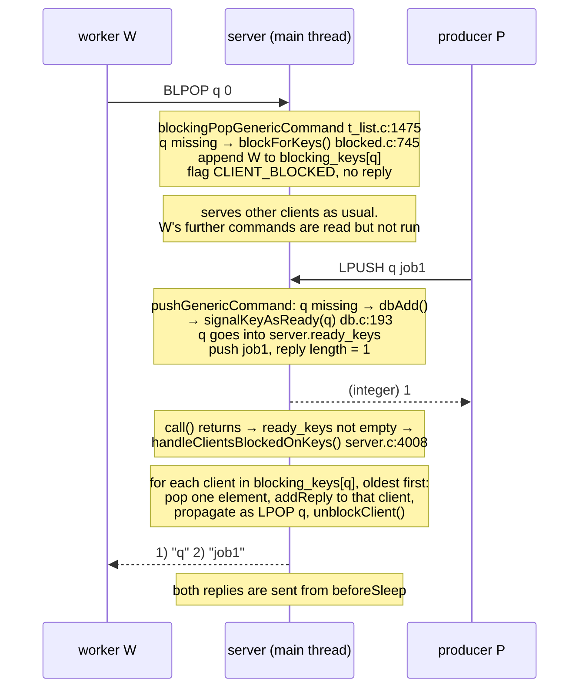

# Redis commands cheat sheet

The commands that come up in our notes, plus the ones you'll see most in
real use. Each entry gives what it does, an example, its time complexity, and
where it's implemented.

Redis 7.0.5. Summaries and complexities come from the command specs in
`redis7.0-chinese-annotated/src/commands/*.json`. Paths are relative to
`redis7.0-chinese-annotated/src/`.
<!-- code-base: redis7.0-chinese-annotated/src -->

**Finding a command's code:** every command `foo` is handled by `fooCommand()`.
Its spec (`commands/foo.json`) names the function. Data-type commands live in
`t_<type>.c` (`t_string.c`, `t_list.c`, …). Key-space commands live in `db.c`.

## Reading replies

Examples use `redis-cli`. On the wire, every reply is RESP. Its first byte
gives the type:

| Wire format | `redis-cli` shows | Meaning |
|---|---|---|
| `+OK\r\n` | `OK` | simple string |
| `-ERR ...\r\n` | `(error) ERR ...` | error |
| `:1\r\n` | `(integer) 1` | integer |
| `$3\r\nbob\r\n` | `"bob"` | bulk string (length-prefixed) |
| `$-1\r\n` / `*-1\r\n` | `(nil)` | no value |
| `*2\r\n...` | `1) ... 2) ...` | array |

Requests are RESP arrays too: `SET name bob` is sent as
`*3\r\n$3\r\nSET\r\n$4\r\nname\r\n$3\r\nbob\r\n` (see
[request-lifecycle/02](architecture/request-lifecycle/02-read-and-parse.md)).

---

## Commands from our notes

| Command | Where it came up |
|---|---|
| `SET`, `GET` | the running example in [02-read-and-parse](architecture/request-lifecycle/02-read-and-parse.md); `set` → `setCommand` lookup in [00-startup](architecture/request-lifecycle/00-startup.md) |
| `BLPOP`, `LPUSH` | blocked clients in [event-loop](architecture/event-loop.md); explained in depth [below](#blpop-key-key--timeout) |
| `AUTH`, `ACL ...` | `ACLInit()` in [00-startup](architecture/request-lifecycle/00-startup.md) |
| `CONFIG SET` | the protected-mode error in [01-accept](architecture/request-lifecycle/01-accept.md) |
| `MULTI`, `EXEC`, `WATCH` | `processCommand()` queues commands inside `MULTI` ([`server.c:4002`](https://github.com/CN-annotation-team/redis7.0-chinese-annotated/blob/e352dafc89b0fcdac3071145e7a99c37f3802452/src/server.c#L4002)) |
| `EVAL`, `SCRIPT KILL`, `FUNCTION KILL`, `SHUTDOWN NOSAVE` | the `-BUSY` reply in [event-loop](architecture/event-loop.md) |
| `BGSAVE` | triggered by `serverCron` from the `save` rules |
| `SELECT` | every new client starts in db 0 (`selectDb(c, 0)`) |

---

## Keys (any type)

| Command | What it does | Example | Complexity | Code |
|---|---|---|---|---|
| `DEL key [key ...]` | Delete keys; returns how many existed | `DEL a b` → `(integer) 1` | O(N) keys; deleting a big list/hash/set is O(M) in its elements | [`db.c:689`](https://github.com/CN-annotation-team/redis7.0-chinese-annotated/blob/e352dafc89b0fcdac3071145e7a99c37f3802452/src/db.c#L689) |
| `EXISTS key [key ...]` | How many of the keys exist | `EXISTS name` → `(integer) 1` | O(N) keys | [`db.c:699`](https://github.com/CN-annotation-team/redis7.0-chinese-annotated/blob/e352dafc89b0fcdac3071145e7a99c37f3802452/src/db.c#L699) |
| `EXPIRE key seconds` | Set a time-to-live; the key is deleted after it | `EXPIRE name 60` → `(integer) 1` | O(1) | [`expire.c:666`](https://github.com/CN-annotation-team/redis7.0-chinese-annotated/blob/e352dafc89b0fcdac3071145e7a99c37f3802452/src/expire.c#L666) |
| `TTL key` | Seconds left; `-1` = no TTL, `-2` = no such key | `TTL name` → `(integer) 57` | O(1) | [`expire.c:710`](https://github.com/CN-annotation-team/redis7.0-chinese-annotated/blob/e352dafc89b0fcdac3071145e7a99c37f3802452/src/expire.c#L710) |
| `TYPE key` | Type of the value | `TYPE queue` → `list` | O(1) | [`db.c:1051`](https://github.com/CN-annotation-team/redis7.0-chinese-annotated/blob/e352dafc89b0fcdac3071145e7a99c37f3802452/src/db.c#L1051) |
| `SCAN cursor [MATCH p] [COUNT n]` | Walk the key space a little per call; start and end at cursor `0` | `SCAN 0 MATCH user:* COUNT 100` | O(1) per call | [`db.c:1015`](https://github.com/CN-annotation-team/redis7.0-chinese-annotated/blob/e352dafc89b0fcdac3071145e7a99c37f3802452/src/db.c#L1015) |
| `KEYS pattern` | Every matching key in one reply | `KEYS user:*` | **O(N) over the whole db** | [`db.c:738`](https://github.com/CN-annotation-team/redis7.0-chinese-annotated/blob/e352dafc89b0fcdac3071145e7a99c37f3802452/src/db.c#L738) |

> **Don't run `KEYS` in production.** Redis has one main thread
> ([event-loop](architecture/event-loop.md)), so a `KEYS` over millions of keys
> stops every other client until it finishes. Use `SCAN` instead.

## Strings

The simplest type: one key, one value (text, a number, or binary up to 512MB).

### `SET key value [NX | XX] [GET] [EX s | PX ms | EXAT ts | PXAT ts | KEEPTTL]`

Store `value` under `key`, replacing any old value **and its TTL**.

```
SET name bob                → OK
SET session:42 abc EX 3600  → OK          expires in 1 hour
SET lock:job1 me NX PX 5000 → OK          only if lock:job1 doesn't exist yet
SET lock:job1 you NX        → (nil)       already taken
SET name alice GET          → "bob"       set, and return the old value
```

- `NX` = only if the key does **not** exist; `XX` = only if it **does**.
  `SET ... NX PX` is the usual building block for a simple distributed lock.
- `KEEPTTL` keeps the existing TTL instead of clearing it.
- O(1). Code: [`t_string.c:368`](https://github.com/CN-annotation-team/redis7.0-chinese-annotated/blob/e352dafc89b0fcdac3071145e7a99c37f3802452/src/t_string.c#L368).

### `GET key`

```
GET name     → "bob"
GET missing  → (nil)
```

Fails with `WRONGTYPE` if the key holds a non-string value. O(1). Code: [`t_string.c:418`](https://github.com/CN-annotation-team/redis7.0-chinese-annotated/blob/e352dafc89b0fcdac3071145e7a99c37f3802452/src/t_string.c#L418).

### Other string commands

| Command | What it does | Example | Complexity | Code |
|---|---|---|---|---|
| `INCR key` | Add 1 to an integer value (a missing key counts as 0); atomic, so it works as a counter | `INCR views` → `(integer) 1` | O(1) | [`t_string.c:812`](https://github.com/CN-annotation-team/redis7.0-chinese-annotated/blob/e352dafc89b0fcdac3071145e7a99c37f3802452/src/t_string.c#L812) |
| `MGET key [key ...]` | Several `GET`s in one round trip | `MGET a b` → `1) "1" 2) (nil)` | O(N) keys | [`t_string.c:700`](https://github.com/CN-annotation-team/redis7.0-chinese-annotated/blob/e352dafc89b0fcdac3071145e7a99c37f3802452/src/t_string.c#L700) |
| `MSET k v [k v ...]` | Several `SET`s, atomically | `MSET a 1 b 2` → `OK` | O(N) keys | [`t_string.c:755`](https://github.com/CN-annotation-team/redis7.0-chinese-annotated/blob/e352dafc89b0fcdac3071145e7a99c37f3802452/src/t_string.c#L755) |

## Lists

An ordered sequence of strings. Pushing or popping at either end is cheap,
so lists work well as queues.

| Command | What it does | Example | Complexity | Code |
|---|---|---|---|---|
| `LPUSH key v [v ...]` | Insert at the head; returns the new length (details [below](#lpush-key-element-element-)) | `LPUSH queue job1` → `(integer) 1` | O(1) per element | [`t_list.c:407`](https://github.com/CN-annotation-team/redis7.0-chinese-annotated/blob/e352dafc89b0fcdac3071145e7a99c37f3802452/src/t_list.c#L407) |
| `RPUSH key v [v ...]` | Insert at the tail | `RPUSH queue job2` → `(integer) 2` | O(1) per element | [`t_list.c:413`](https://github.com/CN-annotation-team/redis7.0-chinese-annotated/blob/e352dafc89b0fcdac3071145e7a99c37f3802452/src/t_list.c#L413) |
| `LPOP key [count]` | Remove and return from the head | `LPOP queue` → `"job1"` | O(N) returned | [`t_list.c:872`](https://github.com/CN-annotation-team/redis7.0-chinese-annotated/blob/e352dafc89b0fcdac3071145e7a99c37f3802452/src/t_list.c#L872) |
| `RPOP key [count]` | Remove and return from the tail | `RPOP queue` → `"job2"` | O(N) returned | [`t_list.c:878`](https://github.com/CN-annotation-team/redis7.0-chinese-annotated/blob/e352dafc89b0fcdac3071145e7a99c37f3802452/src/t_list.c#L878) |
| `LRANGE key start stop` | Read a range; `0 -1` = everything | `LRANGE queue 0 -1` | O(S+N) | [`t_list.c:884`](https://github.com/CN-annotation-team/redis7.0-chinese-annotated/blob/e352dafc89b0fcdac3071145e7a99c37f3802452/src/t_list.c#L884) |

### `LPUSH key element [element ...]`

Inserts the elements at the **head** of the list and returns the new length.
If the key doesn't exist, it creates an empty list first. If the key holds
another type, it fails with `WRONGTYPE`. O(1) per element. Code:
[`t_list.c:354`](https://github.com/CN-annotation-team/redis7.0-chinese-annotated/blob/e352dafc89b0fcdac3071145e7a99c37f3802452/src/t_list.c#L354).

**Several elements go in one at a time, left to right.** Each one goes in at
the head, so they end up in reverse order:

```
LPUSH q a b c     → (integer) 3
LRANGE q 0 -1     → 1) "c"  2) "b"  3) "a"
```

`RPUSH q a b c` keeps the order (`a b c`). All the elements go in within the
same command, so no other client can see a half-pushed list.

**Which end you pop from decides queue or stack:**

| Push | Pop | Behaves as | `LPUSH q a b c`, then pop three times |
|---|---|---|---|
| `LPUSH` | `RPOP` / `BRPOP` | **queue** (FIFO) | `a`, `b`, `c` |
| `RPUSH` | `LPOP` / `BLPOP` | **queue** (FIFO) | (with `RPUSH q a b c`) `a`, `b`, `c` |
| `LPUSH` | `LPOP` / `BLPOP` | **stack** (LIFO) | `c`, `b`, `a` |

So a worker queue is `LPUSH` + `BRPOP`, or `RPUSH` + `BLPOP`. `LPUSH` +
`BLPOP` serves the **newest** job first.

### `BLPOP key [key ...] timeout`

**Blocking `LPOP`.** It returns a two-element array: which key the element
came from, and the element. `timeout` is in seconds, decimals are allowed,
and `0` means wait forever.

1. **Some list is non-empty:** it checks the keys **left to right** and pops
   from the first non-empty one. It never waits in this case.
2. **All are empty or missing:** the client **waits**. Whichever of its keys
   receives an element first wakes it up.
3. **Timeout:** it replies `(nil)` (`*-1`, a null array).

```
# worker W                          # producer P
BLPOP q 5
  (no reply yet: W is blocked)
                                    LPUSH q job1   → (integer) 1
1) "q"        ← which key
2) "job1"     ← the element

BLPOP q 5
  (nobody pushes for 5 s)
(nil)
```

Code: `blpopCommand` [`t_list.c:1558`](https://github.com/CN-annotation-team/redis7.0-chinese-annotated/blob/e352dafc89b0fcdac3071145e7a99c37f3802452/src/t_list.c#L1558) → `blockingPopGenericCommand`
[`t_list.c:1475`](https://github.com/CN-annotation-team/redis7.0-chinese-annotated/blob/e352dafc89b0fcdac3071145e7a99c37f3802452/src/t_list.c#L1475). `BRPOP` is the same, popping from the tail.

#### How blocking works

The server has only one thread, so "blocking" can't mean the thread waits.
It means the server **parks the client and doesn't reply yet**. Three
structures do the bookkeeping:

| Structure | Maps | Used for |
|---|---|---|
| `db->blocking_keys` | key → list of clients waiting on it, oldest first | finding who to wake |
| `server.ready_keys` (+ `db->ready_keys` to deduplicate) | keys that got data since the last check | waking only for keys that changed |
| `server.clients_timeout_table` (rax sorted by deadline) | deadline + client | timeouts. Not used for `timeout 0` |



What the source and our experiments show:

- **One push wakes as many waiters as it has elements, oldest waiter first**
  ([`blocked.c:289-290`](https://github.com/CN-annotation-team/redis7.0-chinese-annotated/blob/e352dafc89b0fcdac3071145e7a99c37f3802452/src/blocked.c#L289-L290)). W1 blocked before W2, then `LPUSH q a b c`:

  ```
  LPUSH q a b c     → (integer) 3
  W1 gets  q, "c"
  W2 gets  q, "b"
  LRANGE q 0 -1     → 1) "a"
  ```

- **`LPUSH`'s reply doesn't count what waiters take.** The waiters are served
  only after `LPUSH` has finished and replied ([`t_list.c:393`](https://github.com/CN-annotation-team/redis7.0-chinese-annotated/blob/e352dafc89b0fcdac3071145e7a99c37f3802452/src/t_list.c#L393), then
  [`server.c:4008`](https://github.com/CN-annotation-team/redis7.0-chinese-annotated/blob/e352dafc89b0fcdac3071145e7a99c37f3802452/src/server.c#L4008)). With one waiter, `LPUSH q x` returns `(integer) 1`, yet
  `EXISTS q` right after returns `0`: the waiter took `x` and the now-empty
  list was deleted.
- **Only a newly created key signals.** An empty list is deleted, so a client
  can only be blocked on a missing key. A push that wakes it must create the
  key, and `dbAdd()` is where `signalKeyAsReady()` is called ([`db.c:193`](https://github.com/CN-annotation-team/redis7.0-chinese-annotated/blob/e352dafc89b0fcdac3071145e7a99c37f3802452/src/db.c#L193)).
  `signalKeyAsReady()` ([`blocked.c:846`](https://github.com/CN-annotation-team/redis7.0-chinese-annotated/blob/e352dafc89b0fcdac3071145e7a99c37f3802452/src/blocked.c#L846)) returns immediately when nobody is
  blocked on the key, so pushes with no waiters cost nothing extra.
- **Transactions and scripts are served at the end, and see the final
  state.** `handleClientsBlockedOnKeys()` runs after the whole `EXEC`. With
  `MULTI; LPUSH q t; LPOP q; EXEC`, the list is empty again by then. The
  waiter isn't woken, and keeps waiting for the next push.
- **Inside `MULTI` or a script, `BLPOP` never blocks.** Those contexts set
  `CLIENT_DENY_BLOCKING`, so an empty list replies `(nil)` immediately, even
  with `timeout 0` ([`t_list.c:1544`](https://github.com/CN-annotation-team/redis7.0-chinese-annotated/blob/e352dafc89b0fcdac3071145e7a99c37f3802452/src/t_list.c#L1544)). Blocking there would stall the whole
  server.
- **Replicas and the AOF see `LPOP`, not `BLPOP`.** An immediate pop is
  rewritten to `LPOP key` ([`t_list.c:1534`](https://github.com/CN-annotation-team/redis7.0-chinese-annotated/blob/e352dafc89b0fcdac3071145e7a99c37f3802452/src/t_list.c#L1534)). A served waiter is propagated as
  `LPOP key` ([`t_list.c:1397`](https://github.com/CN-annotation-team/redis7.0-chinese-annotated/blob/e352dafc89b0fcdac3071145e7a99c37f3802452/src/t_list.c#L1397)). Replaying the AOF therefore never blocks. Our
  AOF after the two-waiter test held `LPUSH q a b c`, `LPOP q`, `LPOP q`.
- **Commands pipelined behind a `BLPOP` wait with it.** While a client is
  blocked, its socket is still read, but nothing is parsed. When it is
  unblocked, `unblockClient()` ([`blocked.c:179`](https://github.com/CN-annotation-team/redis7.0-chinese-annotated/blob/e352dafc89b0fcdac3071145e7a99c37f3802452/src/blocked.c#L179)) queues it in
  `server.unblocked_clients`. Then `processUnblockedClients()` in
  `beforeSleep` ([`blocked.c:127`](https://github.com/CN-annotation-team/redis7.0-chinese-annotated/blob/e352dafc89b0fcdac3071145e7a99c37f3802452/src/blocked.c#L127)) runs what it had sent meanwhile. Sending
  `BLPOP q 0` + `PING` in one write returned nothing until a push, then the
  `BLPOP` reply and `+PONG` together.
- **Timeouts are checked once per loop iteration**, by
  `handleBlockedClientsTimeout()` in `beforeSleep` ([`timeout.c:136`](https://github.com/CN-annotation-team/redis7.0-chinese-annotated/blob/e352dafc89b0fcdac3071145e7a99c37f3802452/src/timeout.c#L136)). The
  `epoll_wait` timeout only accounts for timers, so on an idle server a
  `timeout` can fire up to one `serverCron` tick late. `BLPOP q 0.5` returned
  `(nil)` after 0.56 s with `hz 10`.

Experiments were run on 7.0.5 built from this repo (`make MALLOC=libc`).

## Hashes

A key that holds a small map of field → value, like one row or object.

| Command | What it does | Example | Complexity | Code |
|---|---|---|---|---|
| `HSET key f v [f v ...]` | Set fields; returns how many were new | `HSET user:1 name bob age 30` → `(integer) 2` | O(1) per field | [`t_hash.c:799`](https://github.com/CN-annotation-team/redis7.0-chinese-annotated/blob/e352dafc89b0fcdac3071145e7a99c37f3802452/src/t_hash.c#L799) |
| `HGET key f` | Read one field | `HGET user:1 name` → `"bob"` | O(1) | [`t_hash.c:964`](https://github.com/CN-annotation-team/redis7.0-chinese-annotated/blob/e352dafc89b0fcdac3071145e7a99c37f3802452/src/t_hash.c#L964) |
| `HGETALL key` | All fields and values | `HGETALL user:1` → `1) "name" 2) "bob" 3) "age" 4) "30"` | O(N) fields | [`t_hash.c:1136`](https://github.com/CN-annotation-team/redis7.0-chinese-annotated/blob/e352dafc89b0fcdac3071145e7a99c37f3802452/src/t_hash.c#L1136) |

## Sets

An unordered collection of unique strings.

| Command | What it does | Example | Complexity | Code |
|---|---|---|---|---|
| `SADD key m [m ...]` | Add members; returns how many were new | `SADD tags redis db` → `(integer) 2` | O(1) per member | [`t_set.c:454`](https://github.com/CN-annotation-team/redis7.0-chinese-annotated/blob/e352dafc89b0fcdac3071145e7a99c37f3802452/src/t_set.c#L454) |
| `SISMEMBER key m` | Is `m` in the set? | `SISMEMBER tags redis` → `(integer) 1` | O(1) | [`t_set.c:622`](https://github.com/CN-annotation-team/redis7.0-chinese-annotated/blob/e352dafc89b0fcdac3071145e7a99c37f3802452/src/t_set.c#L622) |
| `SMEMBERS key` | All members | `SMEMBERS tags` | O(N) | [`t_set.c:1439`](https://github.com/CN-annotation-team/redis7.0-chinese-annotated/blob/e352dafc89b0fcdac3071145e7a99c37f3802452/src/t_set.c#L1439) (it's `sinterCommand`: the intersection of one set) |

## Sorted sets

Like a set, but every member has a numeric score and members stay ordered by
score. Used for leaderboards, priority queues and time-ordered indexes.

| Command | What it does | Example | Complexity | Code |
|---|---|---|---|---|
| `ZADD key score m [score m ...]` | Add or update members | `ZADD board 100 alice 80 bob` → `(integer) 2` | O(log N) per member | [`t_zset.c:2265`](https://github.com/CN-annotation-team/redis7.0-chinese-annotated/blob/e352dafc89b0fcdac3071145e7a99c37f3802452/src/t_zset.c#L2265) |
| `ZINCRBY key delta m` | Add to a member's score | `ZINCRBY board 5 bob` → `"85"` | O(log N) | [`t_zset.c:2270`](https://github.com/CN-annotation-team/redis7.0-chinese-annotated/blob/e352dafc89b0fcdac3071145e7a99c37f3802452/src/t_zset.c#L2270) |
| `ZSCORE key m` | A member's score | `ZSCORE board alice` → `"100"` | O(1) | [`t_zset.c:4556`](https://github.com/CN-annotation-team/redis7.0-chinese-annotated/blob/e352dafc89b0fcdac3071145e7a99c37f3802452/src/t_zset.c#L4556) |
| `ZRANGE key start stop [REV] [WITHSCORES]` | Members by rank | `ZRANGE board 0 9 REV WITHSCORES` → top 10 | O(log N + M) | [`t_zset.c:3873`](https://github.com/CN-annotation-team/redis7.0-chinese-annotated/blob/e352dafc89b0fcdac3071145e7a99c37f3802452/src/t_zset.c#L3873) |

## Streams

An append-only log of entries, each with an auto-generated ID. Like a list
built for messaging, with consumer groups.

| Command | What it does | Example | Complexity | Code |
|---|---|---|---|---|
| `XADD key * f v [f v ...]` | Append an entry; `*` = generate the ID | `XADD events * type login` → `"1696000000000-0"` | O(1) | [`t_stream.c:1990`](https://github.com/CN-annotation-team/redis7.0-chinese-annotated/blob/e352dafc89b0fcdac3071145e7a99c37f3802452/src/t_stream.c#L1990) |
| `XREADGROUP GROUP g c [BLOCK ms] STREAMS key >` | Read new entries as consumer `c` of group `g`; can block like `BLPOP` | | O(M) returned | [`t_stream.c:2164`](https://github.com/CN-annotation-team/redis7.0-chinese-annotated/blob/e352dafc89b0fcdac3071145e7a99c37f3802452/src/t_stream.c#L2164) (shares `xreadCommand`) |

## Pub/Sub

Fire-and-forget messaging. Messages are not stored: a subscriber that is not
connected misses them.

| Command | What it does | Example | Complexity | Code |
|---|---|---|---|---|
| `SUBSCRIBE ch [ch ...]` | Listen on channels; the connection then only receives messages | `SUBSCRIBE news` | O(N) channels | [`pubsub.c:514`](https://github.com/CN-annotation-team/redis7.0-chinese-annotated/blob/e352dafc89b0fcdac3071145e7a99c37f3802452/src/pubsub.c#L514) |
| `PUBLISH ch message` | Send to every subscriber; returns how many got it | `PUBLISH news hello` → `(integer) 3` | O(N+M) subscribers + patterns | [`pubsub.c:588`](https://github.com/CN-annotation-team/redis7.0-chinese-annotated/blob/e352dafc89b0fcdac3071145e7a99c37f3802452/src/pubsub.c#L588) |

## Transactions

| Command | What it does | Complexity | Code |
|---|---|---|---|
| `MULTI` | Start queuing: following commands reply `QUEUED` instead of running | O(1) | [`multi.c:134`](https://github.com/CN-annotation-team/redis7.0-chinese-annotated/blob/e352dafc89b0fcdac3071145e7a99c37f3802452/src/multi.c#L134) |
| `EXEC` | Run all queued commands back to back; no other client's command runs in between | sum of the queued commands | [`multi.c:174`](https://github.com/CN-annotation-team/redis7.0-chinese-annotated/blob/e352dafc89b0fcdac3071145e7a99c37f3802452/src/multi.c#L174) |
| `WATCH key [key ...]` | Before `MULTI`: if any watched key changes before `EXEC`, `EXEC` aborts and returns `(nil)` (optimistic locking) | O(1) per key | [`multi.c:526`](https://github.com/CN-annotation-team/redis7.0-chinese-annotated/blob/e352dafc89b0fcdac3071145e7a99c37f3802452/src/multi.c#L526) |

```
WATCH balance
GET balance          → "100"
MULTI                → OK
SET balance 90       → QUEUED
EXEC                 → 1) OK      (or (nil) if someone changed balance meanwhile)
```

A Redis transaction has no rollback. If one queued command fails at run
time, the others still run.

## Scripting

| Command | What it does | Complexity | Code |
|---|---|---|---|
| `EVAL script numkeys key ... arg ...` | Run a Lua script atomically on the server | depends on the script | [`eval.c:551`](https://github.com/CN-annotation-team/redis7.0-chinese-annotated/blob/e352dafc89b0fcdac3071145e7a99c37f3802452/src/eval.c#L551) |
| `SCRIPT KILL` | Stop a script that has run too long (only if it hasn't written yet) | O(1) | [`eval.c:589`](https://github.com/CN-annotation-team/redis7.0-chinese-annotated/blob/e352dafc89b0fcdac3071145e7a99c37f3802452/src/eval.c#L589) |
| `FUNCTION KILL` | Same, for Redis 7 functions | O(1) | [`functions.c:603`](https://github.com/CN-annotation-team/redis7.0-chinese-annotated/blob/e352dafc89b0fcdac3071145e7a99c37f3802452/src/functions.c#L603) |

```
EVAL "return redis.call('INCRBY', KEYS[1], ARGV[1])" 1 counter 5  → (integer) 5
```

While a script runs, no other command runs. Once it exceeds
`busy-reply-threshold` (5 s by default), other clients get
`-BUSY Redis is busy running a script` until it finishes or is killed.

## Connection and auth

| Command | What it does | Complexity | Code |
|---|---|---|---|
| `PING` | Health check | O(1) | [`server.c:4342`](https://github.com/CN-annotation-team/redis7.0-chinese-annotated/blob/e352dafc89b0fcdac3071145e7a99c37f3802452/src/server.c#L4342) |
| `AUTH [user] password` | Log in. One argument means the `default` user, the same as old `requirepass` | O(N) passwords of the user | [`acl.c:2942`](https://github.com/CN-annotation-team/redis7.0-chinese-annotated/blob/e352dafc89b0fcdac3071145e7a99c37f3802452/src/acl.c#L2942) |
| `SELECT index` | Switch database (0–15 by default) for this connection | O(1) | [`db.c:709`](https://github.com/CN-annotation-team/redis7.0-chinese-annotated/blob/e352dafc89b0fcdac3071145e7a99c37f3802452/src/db.c#L709) |
| `CLIENT UNBLOCK id` | Wake up another client stuck in `BLPOP` etc. | O(log N) clients | [`networking.c:3087`](https://github.com/CN-annotation-team/redis7.0-chinese-annotated/blob/e352dafc89b0fcdac3071145e7a99c37f3802452/src/networking.c#L3087) (part of `clientCommand`) |

## Server and admin

| Command | What it does | Complexity | Code |
|---|---|---|---|
| `INFO [section]` | Server stats: memory, clients, persistence, replication … | O(1) | [`server.c:6046`](https://github.com/CN-annotation-team/redis7.0-chinese-annotated/blob/e352dafc89b0fcdac3071145e7a99c37f3802452/src/server.c#L6046) |
| `CONFIG SET param value` | Change a setting at runtime (`CONFIG REWRITE` saves it to the file) | O(N) params | [`config.c:788`](https://github.com/CN-annotation-team/redis7.0-chinese-annotated/blob/e352dafc89b0fcdac3071145e7a99c37f3802452/src/config.c#L788) |
| `BGSAVE` | Write an RDB snapshot in a forked child; returns at once | O(1) | [`rdb.c:3568`](https://github.com/CN-annotation-team/redis7.0-chinese-annotated/blob/e352dafc89b0fcdac3071145e7a99c37f3802452/src/rdb.c#L3568) |
| `SHUTDOWN [NOSAVE \| SAVE]` | Stop the server, saving first unless `NOSAVE` | O(N) keys when saving | [`db.c:1057`](https://github.com/CN-annotation-team/redis7.0-chinese-annotated/blob/e352dafc89b0fcdac3071145e7a99c37f3802452/src/db.c#L1057) |
| `ACL SETUSER` / `ACL LOG` | Create or modify users / list denied attempts | O(N) rules / entries | [`acl.c:2562`](https://github.com/CN-annotation-team/redis7.0-chinese-annotated/blob/e352dafc89b0fcdac3071145e7a99c37f3802452/src/acl.c#L2562) (part of `aclCommand`) |
| `COMMAND` | Metadata for every command (the command table from `populateCommandTable()`) | O(N) commands | [`server.c:4859`](https://github.com/CN-annotation-team/redis7.0-chinese-annotated/blob/e352dafc89b0fcdac3071145e7a99c37f3802452/src/server.c#L4859) |
